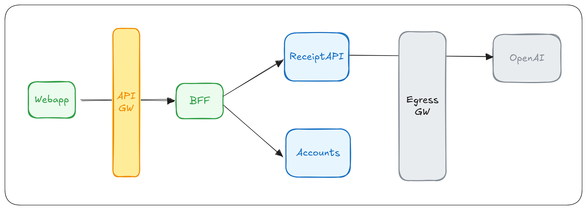

# Expense Tracker

The Expense Tracker is a application built with Choreo that helps users manage their personal finances. This application allows users to:

- Track and categorize their daily expenses
- Upload receipt images for automatic data extraction
- View spending patterns and financial summaries
- Manage multiple accounts and expense categories
- Generate reports for better financial planning

This application demonstrates the power of microservices architecture and AI integration in modern financial management tools.

#### Architecture

The application follows a microservices architecture with the following components:

1. **Web Application (Webapp)**: React-based frontend application that provides the user interface for expense management.

2. **API Gateway (API GW)**: Entry point for all client-side requests that handles routing and authentication.

3. **Backend for Frontend (BFF)**: Orchestration layer that optimizes and aggregates backend service calls for the frontend.

4. **Accounts Service**: Core service responsible for managing user accounts and expense records.

5. **Receipt Service**: Specialized service that processes receipt images and extracts data using OpenAI integration.

6. **Egress Gateway**: Security control point that manages and secures all outbound traffic to external services.

All components are deployed and managed through Choreo, ensuring secure communication and monitoring.
